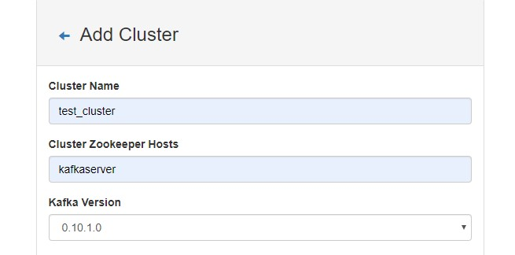
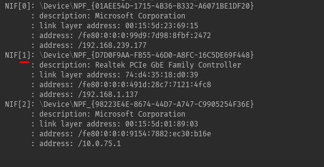

Make sure libpcap or winpap is installed in a case of using pcap4j.
#### Step 1. Prepare.
First of all clone repo:

```
git clone  https://github.com/NikitaBarsukov/BigDataTask.git
```

``` 
cd BigDataTask
```
Then install kafka and postgresql via docker-compose:
``` 
docker-compose up -d
```
Then append this to **hosts**-file
```
127.0.0.1 kafkaserver
```

You should create kafka cluster via kafka-manager (or CLI if you want):
To do this: 
1) Go to localhost:9000;
2) Navigate to top and click "Cluster" -> "add Cluster";
3) Make props like this:



4) Click save.

#### Step 2. Run App.
First of all build the app.
```
gradlew jar
```

Then you can run the app via java

```
java -jar build/libs/DinsBigData-1.0-SNAPSHOT.jar
```

You will see a network devices. Choose a network device from which start capturing.
 

Put 1 to console(from example).
Then the application will start capturing.
After 1024 bytes the app will send message to kafka to **alerts** topic and so on.

### Done.
(Optional)
To view messages via kafka-consumer.
Go to kafka:
```
docker exec -i <kafkaserver containerId> /bin/bash 
```
Then run consumer:
```asp
$KAFKA_HOME/bin/kafka-console-consumer.sh --bootstrap-server localhost:9092 --topic alerts --from-beginning
```